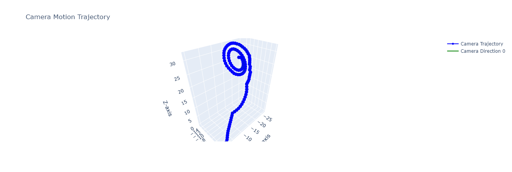
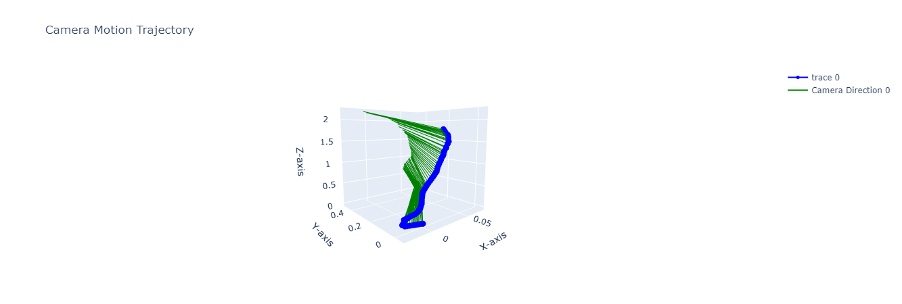
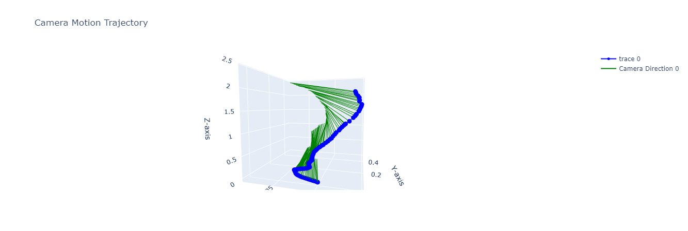

Задание:
Для любых видео восстановить траекторию движения (t вектор). Выполнить визуализацию. 
Определить параметры которые влияют на "точность" определения вектора t
Использовать решение на базе нейронных сетей. 
Любые идеи. 

***slam прикрутить. 
Видео 1 но что бы работало.  

[Ссылка на оригинальное видео](https://drive.google.com/file/d/1clIgyBMa-jIDo3of92evlZPPGfdJ1GIm/view?usp=sharing)

В ходе работы получены следующие результаты:
1. Метод, рассмотренный в рамках урока, не дал корректного результата. Построенная траектория не соответсвует действительности.
2. Положительные результаты дали методы, основанные на построении карты глубины изображения. Лучшая точность получена при использовании Midas для построения карты глубины и kornia для сопоставления точек. Однако данный метод наиболее ресурсоемкий. 

Траектория при использовании SIFT (код из урока)

Траектория при использовании SIFT+MIDAS 

Траектория при использовании MIDAS+kornia 

