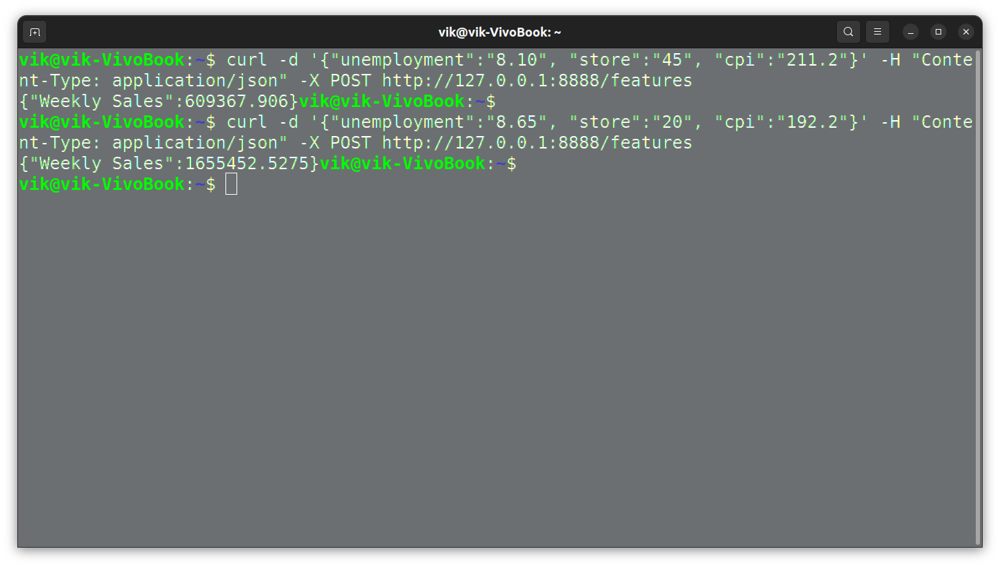

### Задание

Вывести через докер контейнер данные по любой ДР.  
Добавьте в папку README.MD, Dockerfile, файл модели, файл с зависимостями (requirements)
Загрузить на https://hub.docker.com/ 
В README.MD добавить команду для развертывания.
Вставьте ссылку на скриншот вывода POST запроса. 

### Результат

